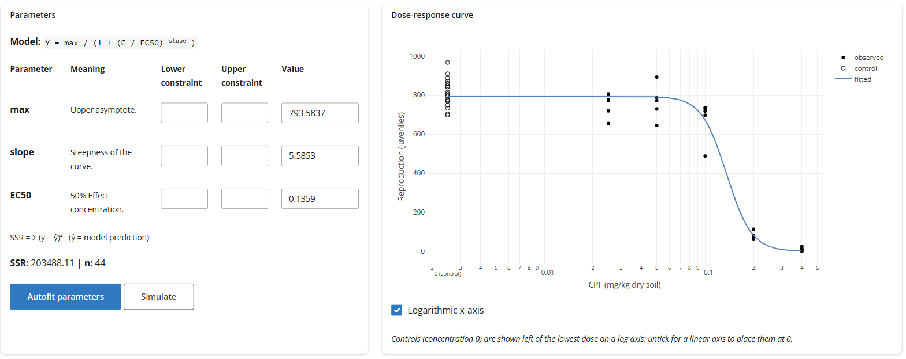
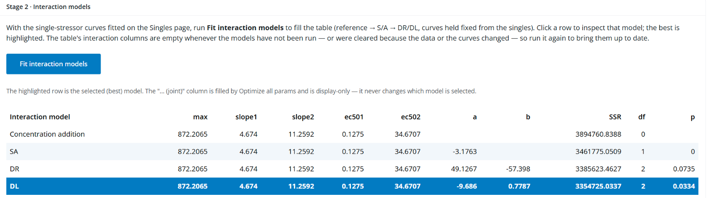
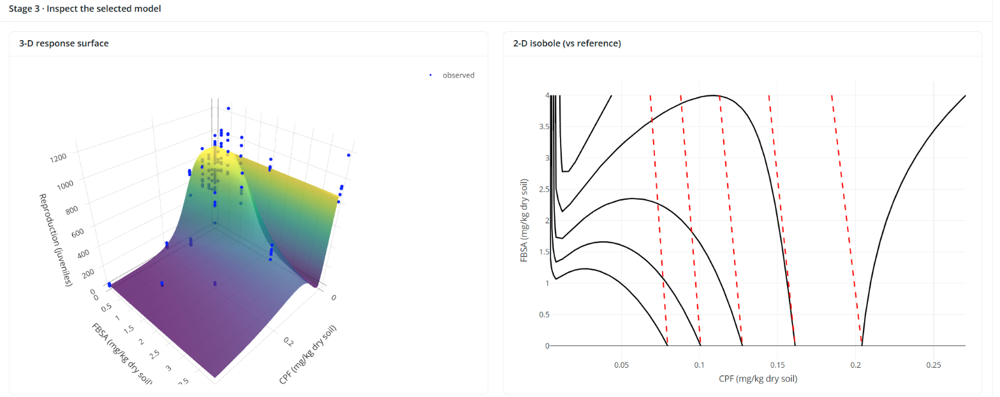

# mixdra

**Mixture dose–response analysis in R — the Jonker et al. (2005) method, made reproducible.**

[](https://github.com/SvL-1/mixdra/actions/workflows/R-CMD-check.yaml)
<!-- validation-badges:start -->
[](https://github.com/SvL-1/mixdra/actions/workflows/validation-report.yaml)
[](VALIDATION.md)
<!-- validation-badges:end -->
[](https://www.gnu.org/licenses/gpl-3.0)
[](https://lifecycle.r-lib.org/articles/stages.html#experimental)

> **Pre-release.** `mixdra` is under active development and validation. The
> engine recovers known parameters from synthetic data and is being checked
> against the published Excel/VBA results, but the API may still change, and a
> few rough edges are tracked in the issues. Please get in touch before using it
> for published work, so we can tell you what is and isn't nailed down.
>
> **Known issue.** The order in which the multi-stressor workflow fits the upper
> asymptote (per stressor for the singles, one per mixture for the binaries and
> the ternary) is being revised, see
> [#15](https://github.com/SvL-1/mixdra/issues/15). Interaction results from the
> Multiple stressors tab can change once that is done.
>
> **Read the guidance first.** Correct use and interpretation of the results
> depend on the accompanying guidance document and research paper (in
> preparation). The model is still being refined, so treat its output as
> provisional and do not use it without reading those first.

`mixdra` fits single-chemical and **binary/ternary mixture** dose–response models, detects and
quantifies how mixtures *deviate* from additivity (synergism, antagonism, dose-ratio- and
dose-level-dependent interactions), and tells you **which interaction pattern the data actually
support** via likelihood-ratio testing. It ships with a point-and-click Shiny app for
non-programmers and a clean scriptable API for everyone else.

It replaces a manual Excel/VBA + GRG-Solver workflow — the kind that lives in one spreadsheet on
one laptop and is almost impossible to reproduce or peer-review — with tested, version-controlled,
open-source code.

---

## Why this exists

The standard reference for mixture-toxicity interaction analysis — **Jonker, Svendsen, Bedaux,
Bongers & Kammenga (2005)**, *Environmental Toxicology and Chemistry* 24(10):2701–2713
([doi:10.1897/04-431R.1](https://doi.org/10.1897/04-431R.1)) — is widely cited, but in practice
it is run through a hand-driven Excel workbook: the model equations live in VBA, and the fitting
is done by clicking Excel's Solver, one model at a time, by hand.

That means every analysis is:

- **hard to reproduce** — the result depends on which cells were selected and which Solver run was
  accepted;
- **hard to trust** — there is no test suite, no version history, no record of the starting values;
- **hard to share** — it is one `.xlsm` file, not a tool.

`mixdra` takes the *same science* — the method behind a peer-reviewed 2025 *Journal of Hazardous
Materials* study of microplastic, PFAS, and pesticide mixtures (see [Citation](#citation)) — and
makes it a proper instrument: a pure computational engine (no spreadsheet, no GUI required) with a
regression test suite pinned against the original Excel results, wrapped in a modern Shiny
dashboard.

**Why trust that it is the same method.** Claus Svendsen is a co-author of *both* papers —
the 2005 paper that defines the methodology and the 2025 study that applies it here. This
implementation is not a third party's reading of a twenty-year-old method; it runs the line
straight from the people who defined it, and every model is checked against the original
workbooks that produced the published results.

## What it does

For **1, 2, or 3 chemicals**, `mixdra`:

- fits the per-chemical **log-logistic dose–response curves**;
- fits the two standard additivity **reference models** — **Concentration Addition (CA)** and
  **Independent Action (IA)**;
- fits the **deviation models** layered on top of each reference:
  - **S/A** — overall synergism / antagonism,
  - **DR** — dose-ratio-dependent deviation (binary),
  - **DL** — dose-level-dependent deviation (binary),
  - **Advanced S/A** — per-corner interaction for ternary mixtures;
- runs **likelihood-ratio tests** between each nested pair and flags the **most parsimonious
  model** — the simplest description the data don't reject;
- handles both **continuous** responses (sum-of-squares objective) and **binary / quantal**
  responses (binomial likelihood, *exposed* / *affected* counts).

## What it looks like

**Start with one chemical.** Everything in `mixdra` is built on the three-parameter
log-logistic curve, so that is where the app starts too: upload concentrations and
responses, and read off the upper asymptote, the slope and the EC50 with the fitted
curve beside them. Here, chlorpyrifos against the reproduction of *Folsomia candida*:



**Then the mixture.** A campaign is one uploaded file covering two or three stressors.
`mixdra` fits each stressor's curve once, holds those curves fixed, and then fits the
interaction terms for every pair — so an interaction shows up as `a`/`b`, rather than
being quietly absorbed by refitted curves.

**The model comparison.** Each pair's reference, S/A, DR and DL models side by side,
with the likelihood-ratio test against the parent model and the selected (most
parsimonious) model highlighted. Here the dose-level-dependent model wins for
chlorpyrifos × FBSA (*p* = 0.033):



**The diagnostics.** The selected model's fitted response surface and its isoboles
against the additivity reference (dashed, red), so departures from additivity are
visible rather than inferred from a number:



## Features

- **One engine, three scales.** Single, binary, and ternary mixtures all run through a single
  n-agnostic predictor — no copy-pasted per-case model code to drift out of sync.
- **Automatic fit-and-compare.** `analyse_mixture()` fits the whole reference → S/A → {DR, DL}
  chain, builds the LR-test comparison table, and selects the winning model in one call.
- **Staged maximum-likelihood fitting.** Curve parameters are identified from the single-compound
  rows, then only the interaction parameters are fit to the mixture data — robust, fast, and
  faithful to how the method is meant to work.
- **A real optimiser, not a spreadsheet.** Base-R `optim` (L-BFGS-B with a Nelder-Mead fallback
  for the non-smooth CA bisection surface), **multi-start** seeding, hard parameter **bounds**,
  and the ability to **fix / pin** individual parameters — plus a "joint refine all parameters"
  mode that mirrors the Excel single-SSR fit when you want a digit-for-digit comparison.
- **Rich diagnostics & plots.** Dose–response curves, observed-vs-predicted, 3-D response
  surfaces, 2-D isoboles/contours, ternary **isoplanes** and **σ–TU** curves.
- **Validated.** A `testthat` suite checks the engine against the original Excel workbooks *and*
  against synthetic data with known parameters (params-in == params-out recovery on noise-free
  data).
- **Lean.** The engine depends only on `stats` and `numDeriv`; the Shiny UI stack is optional
  (Suggested) and only needed if you launch the app.

## Installation

```r
# install.packages("remotes")
remotes::install_github("SvL-1/mixdra")
```

To use the interactive app, also install the (Suggested) UI packages:

```r
install.packages(c("shiny", "bslib", "plotly", "DT"))
```

## Quick start

### The app (no coding)

```r
mixdra::run_app()
```

Opens a `bslib` dashboard with three tabs: **Introduction** for experiment
metadata, **Single Stressor** for a standalone one-stressor experiment, and
**Campaign** for a full mixture study.

A campaign is one uploaded file covering two or three stressors — single-stressor
rows carry zeros in the other concentrations, pair rows carry zero in the third.
Its sub-tabs run the study in order:

1. **Singles** — every stressor's dose-response curve, fitted once. These curves
   are the campaign's single source of truth.
2. **One sub-tab per pair** — the interaction model comparison
   (reference → S/A → DR/DL) for each pair, with the single-stressor curves held
   fixed so interaction shows up as `a`/`b` rather than being absorbed by
   refitted curves.
3. **Ternary** — the staged Advanced-S/A fit, reusing both the frozen curves and
   the pairwise terms already fitted above. Present only for a three-stressor
   campaign, and currently CA + continuous only.

The Single Stressor tab is an independent scratchpad: it shares only the
experiment-metadata fields (the stressor name and unit it puts on its own axes);
it neither reads nor writes any campaign analysis state.

### Scripted analysis

```r
library(mixdra)

# `df` has C1, C2 concentration columns plus either `Res` (continuous)
# or `Exposed` / `Affected` (quantal).
result <- analyse_mixture(df, reference = "CA", response = "continuous")

result$chosen        # name of the selected model, e.g. "CA_DR"
result$comparison    # likelihood-ratio test table (χ², df, p-value vs parent)
result$fits          # every fitted model, with parameters and fit statistics
```

Single chemicals and ternary mixtures use the matching entry points:

```r
analyse_single(conc, resp)               # one log-logistic curve
analyse_ternary(df, reference = "CA")    # 3-chemical fit + Advanced S/A
```

Need synthetic data to sanity-check a design before you run the experiment?

```r
sim <- simulate_mixture(reference = "CA", deviation = "DR", ...)  # generate, then recover
```

## Outputs

Every analysis returns the parameter block you'd expect from the paper and the Excel workbook —
fitted `max`, per-chemical slopes and EC50s, the interaction parameters (`a`, `b`/`b_i`),
the objective value (SS or −2·logL), and the LR-test comparison — plus tidy result tables
(`result_table()`, `ternary_effect_table()`) and the full plotting family
(`plot_dose_response()`, `plot_obs_pred()`, `plot_surface()`, `plot_isobole()`,
`plot_isoplane()`, `plot_sigma_tu()`).

## The method, briefly

Each chemical is described by a three-parameter log-logistic curve. **CA** combines chemicals on a
shared toxic-unit (concentration) scale; **IA** combines them on a probabilistic (effect) scale.
A single interaction term is then added to the reference model to capture a specific *pattern* of
non-additivity, and nested models are compared by likelihood ratio so the reported interaction is
the one the data justify — not the most flattering one. See Jonker et al. (2005) for the full
derivation.

For a full worked walkthrough — fitting curves, comparing models, and reading the results on a
real dataset — see the **methodology vignette** (`vignette("methodology", package = "mixdra")`).

## Validation & testing

The engine is checked two ways:

1. **Against the published results** — `mixdra` is expected to land on the EC50 values printed in
   van Loon et al. (2025), and on the parameters and model selections of the original Excel/VBA +
   Solver workbooks the fixtures were extracted from.
2. **Against the truth** — synthetic datasets are generated with known parameters and noise-free,
   then re-fit; the engine must recover the generating parameters.

Every reference target lives in [`inst/validation/oracles.csv`](inst/validation/oracles.csv), one
row per fitted quantity, recording the reference value, where it was read from, the tolerance, and
whether the engine is expected to reproduce it or to differ from it deliberately. References come
from two places: **published** values printed in the peer-reviewed paper (citable, and independent
of the spreadsheet the data was extracted from), and **workbook** cells, which cover quantities the
paper does not print. That one table drives both the automated tests and the rendered validation
report, so a number cannot be reported without being asserted, or asserted without being reported.

The experiments behind the data are recorded in
[`inst/validation/datasets.csv`](inst/validation/datasets.csv): organism and life stage, endpoint,
exposure duration, OECD guideline, soil, units, mixture ratios, the publication and its DOI, and
the caveats a reader needs in order to read the reference values correctly — for instance that the
microplastics EC50 is not measured but fixed at three times the NOEC, and that the FBSA EC50 of
5.58 mg/kg comes from a range-finding test rather than the experiment itself. The raw survival and
reproduction data are openly available at
[doi:10.5281/zenodo.14961673](https://doi.org/10.5281/zenodo.14961673).

```r
# run the suite (or a single file)
devtools::test()
devtools::test(filter = "recovery")
```

**[VALIDATION.md](VALIDATION.md)** is the generated report: every workbook value next to what
this version of the package actually fits, with the difference and how much of the allowed
tolerance it uses. It is regenerated rather than edited, and the badge above carries its score.

The `validation-report` CI workflow rebuilds it on every push and pull request. It fails if any
reference value is no longer reproduced, or if the README badge claims a score the run does not
support — the badge counts verdicts, so it is stable across platforms. It does *not* fail when the
committed document differs only in the last digits of a fitted value, which can happen between
platforms: that drift is reported as a notice for whoever wants to refresh the copy. The run also
attaches an HTML version. To rebuild locally:

```sh
Rscript tools/validation-report.R
```

Adding a newly published dataset is a data-entry job: drop the fixture CSV in
`tests/testthat/fixtures/`, register how to fit it in `validation_datasets()`, and add its rows to
the oracle table. No new test code.

## Scope

**In scope (v1):** single + binary + ternary mixtures; CA and IA references; S/A, DR, DL, and
Advanced S/A deviations; continuous and quantal responses; run-locally Shiny app.

**Out of scope (for now):** more than 3 chemicals; non-monotonic (J-shaped / hormesis)
curves. There is deliberately no hosted web version: the app runs locally, so your data
never leaves your machine.

## Citation

`mixdra` implements the interaction-analysis method used in:

> van Loon, S., Xie, G., Svendsen, C., Kraak, M.H.S., de Jeu, L., Schut, N.C., Sprokkereef, E.,
> Hurley, R., van Wezel, A.P. & van Gestel, C.A.M. (2025). Microplastics and PFAS as ubiquitous
> pollutants affect potencies of highly toxic chemicals in mixtures. *Journal of Hazardous
> Materials*, 500, 140493. https://doi.org/10.1016/j.jhazmat.2025.140493

and is based on the underlying methodology of:

> Jonker, M.J., Svendsen, C., Bedaux, J.J.M., Bongers, M. & Kammenga, J.E. (2005). Significance
> testing of synergistic/antagonistic, dose level–dependent, or dose ratio–dependent effects in
> mixture dose–response analysis. *Environmental Toxicology and Chemistry*, 24(10), 2701–2713.
> https://doi.org/10.1897/04-431R.1

Please cite both if you use this package in published work. A machine-readable
[`CITATION.cff`](CITATION.cff) is included, so GitHub's "Cite this repository" button
gives you the entry directly.

The raw survival and reproduction data behind the 2025 study are openly archived on
Zenodo: [doi:10.5281/zenodo.14961673](https://doi.org/10.5281/zenodo.14961673). Paper,
data, and code are therefore all citable and linked.

## Funding

The research this package implements was funded by the **PAPILLIONS** and **PARC**
projects under the European Union's Research and Innovation Framework Programmes
(Horizon 2020 grant agreement No 101000210 and Horizon Europe agreement No 101057014),
and by the Open Technology Programme of the Netherlands Organisation for Scientific
Research (NWO), domain Applied and Engineering Sciences (TTW), project number 18725.

## License

GPL (>= 3). See [`LICENSE.md`](LICENSE.md).
